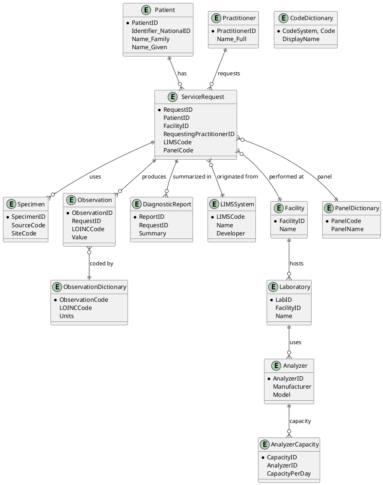

# 🧬 Universal Laboratory Data Model for Laboratory Information Systems (ULDM)

## 🎯 Objective
This project aims to standardize laboratory data storage in Laboratory Information Management Systems (LIMS), promoting interoperability, integration, and compliance with international standards such as **HL7 FHIR**, **SNOMED CT**, and **LOINC**.

---

## 🧱 General Model Structure

The model is divided into main entities:

- **Patient**: Demographic and administrative patient data
- **Practitioner**: Healthcare professionals involved
- **ServiceRequest**: Laboratory analysis request
- **Specimen**: Collected sample data
- **Observation**: Laboratory results
- **DiagnosticReport**: Consolidated analysis report
- **LIMSSystem**: Metadata from the originating LIMS system
- **Facility**: Healthcare facilities
- **Laboratory**: Associated laboratories
- **Analyzer**: Analysis equipment
- **AnalyzerCapacity**: Equipment capacity
- **CodeDictionary**: HL7, SNOMED CT, and LOINC code dictionary
- **PanelDictionary**: Laboratory test panels
- **ObservationDictionary**: Laboratory observations and their interpretations

---

## 🔗 Standards Used

| Standard    | Application                                                              |
|-------------|--------------------------------------------------------------------------|
| HL7 FHIR    | Resource structure like Patient, ServiceRequest, Observation, Specimen   |
| SNOMED CT   | Coding for diagnoses, findings, procedures, and anatomical sites         |
| LOINC       | Coding for laboratory tests and observations                             |

---

## 🧾 Universal SQL Script (schema.sql)
```sql
-- Schema.sql
-- =========================
/* UNIVERSAL LABORATORY INFORMATION SYSTEM DATA MODEL
   Compatible with: MySQL 8, PostgreSQL, SQL Server, Oracle
   Standards: HL7 FHIR, SNOMED CT, LOINC */

CREATE TABLE Patient (
  PatientID VARCHAR(64) PRIMARY KEY,
  Identifier_NationalID VARCHAR(30),
  Identifier_HealthcareNumber VARCHAR(30),
  Name_Family VARCHAR(50),
  Name_Given VARCHAR(50),
  BirthDate DATE,
  GenderCode CHAR(1),
  EthnicityCode VARCHAR(10),
  Contact_Email VARCHAR(100),
  Contact_PhoneHome VARCHAR(20),
  Contact_PhoneMobile VARCHAR(20),
  Address_LocationCode VARCHAR(10),
  Deceased BOOLEAN,
  Newborn BOOLEAN
);

CREATE TABLE Practitioner (
  PractitionerID VARCHAR(64) PRIMARY KEY,
  Name_Full VARCHAR(100),
  Identifier_Code VARCHAR(30),
  Contact_Email VARCHAR(100),
  Contact_Phone VARCHAR(20)
);

CREATE TABLE ServiceRequest (
  RequestID VARCHAR(64) PRIMARY KEY,
  PatientID VARCHAR(64) NOT NULL,
  RequestingPractitionerID VARCHAR(64),
  RequestingFacilityID VARCHAR(30),
  LIMSCode VARCHAR(10),
  PanelCode VARCHAR(20),
  PanelDescription VARCHAR(100),
  PriorityCode CHAR(1),
  RequestedDateTime DATETIME,
  SpecimenID VARCHAR(64),
  ClinicalInfo TEXT,
  ICD10Code VARCHAR(10),
  Therapy TEXT,
  FOREIGN KEY (PatientID) REFERENCES Patient(PatientID),
  FOREIGN KEY (RequestingPractitionerID) REFERENCES Practitioner(PractitionerID)
);

CREATE TABLE Specimen (
  SpecimenID VARCHAR(64) PRIMARY KEY,
  SourceCode VARCHAR(10),
  SiteCode VARCHAR(10),
  CollectionDateTime DATETIME,
  Volume FLOAT,
  RejectionCode VARCHAR(10),
  RejectionReason TEXT
);

CREATE TABLE Observation (
  ObservationID VARCHAR(64) PRIMARY KEY,
  RequestID VARCHAR(64) NOT NULL,
  LOINCCode VARCHAR(30),
  Value FLOAT,
  Units VARCHAR(20),
  ReferenceRangeLow FLOAT,
  ReferenceRangeHigh FLOAT,
  AbnormalFlagCode VARCHAR(5),
  ResultStatusCode CHAR(1),
  ResultDateTime DATETIME,
  InterpretationCode VARCHAR(20),
  Note TEXT,
  FOREIGN KEY (RequestID) REFERENCES ServiceRequest(RequestID)
);

CREATE TABLE DiagnosticReport (
  ReportID VARCHAR(64) PRIMARY KEY,
  RequestID VARCHAR(64) NOT NULL,
  ReportDateTime DATETIME,
  AuthorisedByPractitionerID VARCHAR(64),
  Summary TEXT,
  FOREIGN KEY (RequestID) REFERENCES ServiceRequest(RequestID)
);

CREATE TABLE LIMSSystem (
  LIMSCode VARCHAR(10) PRIMARY KEY,
  Name VARCHAR(100),
  Developer VARCHAR(100),
  Version VARCHAR(20),
  ReleaseYear INT,
  LicenseType VARCHAR(50),
  LicenseValidUntil DATE,
  CertificationStatus VARCHAR(50),
  HL7FHIRCompatible BOOLEAN,
  SNOMEDCompatible BOOLEAN,
  LOINCCompatible BOOLEAN
);

CREATE TABLE Facility (
  FacilityID VARCHAR(30) PRIMARY KEY,
  Name VARCHAR(100),
  TypeCode VARCHAR(10),
  CountryCode VARCHAR(2),
  Location_Point VARCHAR(100),
  NationalCode VARCHAR(30)
);

CREATE TABLE Laboratory (
  LabID VARCHAR(30) PRIMARY KEY,
  FacilityID VARCHAR(30),
  Name VARCHAR(100),
  Type VARCHAR(30),
  StaffingLevel VARCHAR(30),
  FOREIGN KEY (FacilityID) REFERENCES Facility(FacilityID)
);

CREATE TABLE Analyzer (
  AnalyzerID VARCHAR(30) PRIMARY KEY,
  Manufacturer VARCHAR(50),
  Model VARCHAR(50),
  SerialNumber VARCHAR(50),
  InstalledDate DATETIME,
  LaboratoryID VARCHAR(30),
  FOREIGN KEY (LaboratoryID) REFERENCES Laboratory(LabID)
);

CREATE TABLE AnalyzerCapacity (
  CapacityID INT PRIMARY KEY,
  AnalyzerID VARCHAR(30),
  CapacityPerDay INT,
  FOREIGN KEY (AnalyzerID) REFERENCES Analyzer(AnalyzerID)
);

CREATE TABLE CodeDictionary (
  CodeSystem VARCHAR(20),
  Code VARCHAR(30),
  DisplayName VARCHAR(100),
  Description TEXT,
  IsActive BOOLEAN,
  LastUpdated DATE,
  PRIMARY KEY (CodeSystem, Code)
);

CREATE TABLE PanelDictionary (
  PanelCode VARCHAR(20) PRIMARY KEY,
  PanelName VARCHAR(100),
  Description TEXT,
  LOINCCode VARCHAR(20),
  SNOMEDCode VARCHAR(20),
  HL7SectionCode VARCHAR(10)
);

CREATE TABLE ObservationDictionary (
  ObservationCode VARCHAR(30) PRIMARY KEY,
  Description TEXT,
  LOINCCode VARCHAR(20),
  SNOMEDCode VARCHAR(20),
  HL7ResultTypeCode VARCHAR(5),
  Units VARCHAR(20),
  ReferenceRangeLow FLOAT,
  ReferenceRangeHigh FLOAT,
  InterpretationGuideline TEXT
);
```

## 🚀 Quick Installation Guide

This guide shows how to import the `schema.sql` file in different relational database systems.

### 🐬 MySQL 8

1. Create a database:
   ```bash
   mysql -u root -p -e "CREATE DATABASE labdb CHARACTER SET utf8mb4 COLLATE utf8mb4_unicode_ci;"
   ```

2. Import the `schema.sql` file:
   ```bash
   mysql -u root -p labdb < schema.sql
   ```

### 🐘 PostgreSQL

1. Create a database:
   ```bash
   psql -U postgres -c "CREATE DATABASE labdb;"
   ```

2. Import the `schema.sql` file:
   ```bash
   psql -U postgres -d labdb < schema.sql
   ```

### 🐉 SQL Server

1. Create a database:
   ```bash
   sqlcmd -S localhost -U sa -P <password> -Q "CREATE DATABASE labdb;"
   ```

2. Import the `schema.sql` file:
   ```bash
   sqlcmd -S localhost -U sa -P <password> -d labdb -i schema.sql
   ```

### 🐍 Oracle

1. Create a database:
   ```bash
   sqlplus / as sysdba "CREATE DATABASE labdb;"
   ```

2. Import the `schema.sql` file:
   ```bash
   sqlplus labdb/ < schema.sql
   ```

## 📜 Practical Example: Simulated Laboratory Request

### 1. Patient
```sql
INSERT INTO Patient VALUES (
  'PAT001', 'US123456789', 'HC987654321', 'Johnson', 'Sarah',
  '1990-06-15', 'F', 'CAU', 'sarah.johnson@example.com',
  '214567890', '848765432', 'LOC001', 0, 0
);
```

### 2. Healthcare Professional
```sql
INSERT INTO Practitioner VALUES (
  'PRAC001', 'Dr. James Smith', 'DR001', 'james.smith@hospital.us', '218765432'
);
```

### 3. Test Request
```sql
INSERT INTO ServiceRequest VALUES (
  'REQ001', 'PAT001', 'PRAC001', 'FAC001', 'LIMS001',
  'PANEL001', 'Basic Biochemistry Panel', 'R', '2025-10-03 10:00:00',
  'SPEC001', 'Patient presents with fatigue and jaundice', 'R17', 'Hydrated with saline'
);
```

### 4. Specimen
```sql
INSERT INTO Specimen VALUES (
  'SPEC001', 'BLD', 'VEN', '2025-10-03 09:45:00', 5.0, NULL, NULL
);
```

### 5. Observations
```sql
INSERT INTO Observation VALUES (
  'OBS001', 'REQ001', '2345-7', 1.2, 'mg/dL', 0.3, 1.0, 'H', 'F',
  '2025-10-03 11:00:00', 'SN123456', 'Elevated total bilirubin value'
);

INSERT INTO Observation VALUES (
  'OBS002', 'REQ001', '2093-3', 180.0, 'mg/dL', 125.0, 200.0, 'N', 'F',
  '2025-10-03 11:00:00', 'SN654321', 'Total cholesterol within normal range'
);
```

### 6. Diagnostic Report
```sql
INSERT INTO DiagnosticReport VALUES (
  'REP001', 'REQ001', '2025-10-03 12:00:00', 'PRAC001',
  'Patient presents with mild hyperbilirubinemia. Normal cholesterol. Additional liver evaluation recommended.'
);
```

### 7. LIMS System Metadata
```sql
INSERT INTO LIMSSystem VALUES (
  'LIMS001', 'LabSystem', 'TechSolutions Inc.', 'v3.2.1', 2023,
  'Proprietary', '2026-12-31', 'HL7 FHIR Certified', 1, 1, 1
);
```

### 8. Code Dictionaries
```sql
INSERT INTO CodeDictionary VALUES (
  'LOINC', '2345-7', 'Total Bilirubin', 'Measures total bilirubin concentration in blood', 1, '2025-01-01'
);

INSERT INTO CodeDictionary VALUES (
  'LOINC', '2093-3', 'Total Cholesterol', 'Measures total cholesterol in blood', 1, '2025-01-01'
);

INSERT INTO CodeDictionary VALUES (
  'SNOMED CT', 'SN123456', 'Hyperbilirubinemia', 'Clinical finding of elevated bilirubin', 1, '2025-01-01'
);

INSERT INTO CodeDictionary VALUES (
  'SNOMED CT', 'SN654321', 'Normal cholesterol', 'Clinical finding of cholesterol within range', 1, '2025-01-01'
);
```

## 🛠️ Technical Requirements
- Compatible with MySQL 8, PostgreSQL, SQL Server, and Oracle
- Support for geographic types for location (POINT, GEOGRAPHY, SDO_GEOMETRY)
- Ready for HL7 FHIR RESTful API integration

## 📊 ER Diagram (PlantUML)
Save as er-diagram.puml and render at [PlantText](https://www.planttext.com/):


## 🔑 Strategy for a Complete Database
### 1. LOINC
- Official source: [LOINC.org](https://loinc.org/downloads/)
- Available in CSV/SQL, with all laboratory, clinical, and observation codes
- Includes: code, name, description, units, method, system, scale, observation type
- Can be imported directly into the `ObservationDictionary` table

### 2. SNOMED CT
- Official source: [SNOMED International](https://www.snomed.org/get-snomed)
- License required (free for member countries, for non-member countries can be used via SNOMED Global Patient Set)
- The **GPS (Global Patient Set)** contains ~7,000 essential clinical concepts, including diagnoses and laboratory findings
- Can be loaded into `CodeDictionary`

### 3. HL7
- Official source: [HL7 Terminology](https://terminology.hl7.org/)
- Includes code tables such as:
  - Result Status (F, C, P, etc.)
  - Abnormal Flags (N, H, L, A, etc.)
  - Priority Codes (S, R, U, etc.)
- These are small sets and can be fully populated

### 4. Test Panels (PanelDictionary)
- Can be used to map national panels (e.g., biochemistry, hematology, virology, microbiology) to LOINC
- Example:
    - Basic Biochemistry Panel → LOINC Panel 24323-8
    - Complete Blood Count → LOINC Panel 58410-2
    - HIV Panel → LOINC Panel 56888-1

## 📂 How to Populate Dictionaries
### a) Import LOINC
- Download the `LOINC.csv` file from the official website
- Create an import script for `ObservationDictionary`
- Example mapping:
```sql
INSERT INTO ObservationDictionary
(ObservationCode, Description, LOINCCode, SNOMEDCode, HL7ResultTypeCode, Units, ReferenceRangeLow, ReferenceRangeHigh, InterpretationGuideline)
VALUES
('OBS_GLU', 'Glucose [Mass/volume] in blood', '2345-7', NULL, 'NM', 'mg/dL', 70, 110, 'Elevated values indicate hyperglycemia');
```

### b) Import SNOMED CT (GPS)
- Download the **Global Patient Set** in CSV
- Load into `CodeDictionary` with `CodeSystem = 'SNOMED CT'`

### c) Import HL7
- Populate manually (small tables)
- Example:
```sql
INSERT INTO CodeDictionary VALUES ('HL7', 'F', 'Final Result', 'Final result', 1, '2025-01-01');
INSERT INTO CodeDictionary VALUES ('HL7', 'C', 'Corrected Result', 'Corrected result', 1, '2025-01-01');
```

## 🚀 Practical Path
1. Create a `seed_data.sql` that:
    - Imports all HL7 codes
    - Imports main panels (biochemistry, hematology, virology, microbiology)
    - Imports sample LOINC and SNOMED CT examples
2. Add ETL scripts to load:
    - Complete LOINC (98k codes)
    - SNOMED GPS (~7k concepts)

## 📌 License
This project is licensed under the MIT License.

## 🤝 Contributions
Contributions are welcome!
Suggestions include:
- Model improvements
- Addition of new codes to the dictionary
- Creation of custom FHIR profiles
- Translation of documentation to other languages

## 📞 Contact
- Author: Irzelindo Salvador
- Location: Maputo, Mozambique
- Email: [irzelindo.salvador@gmail.com]