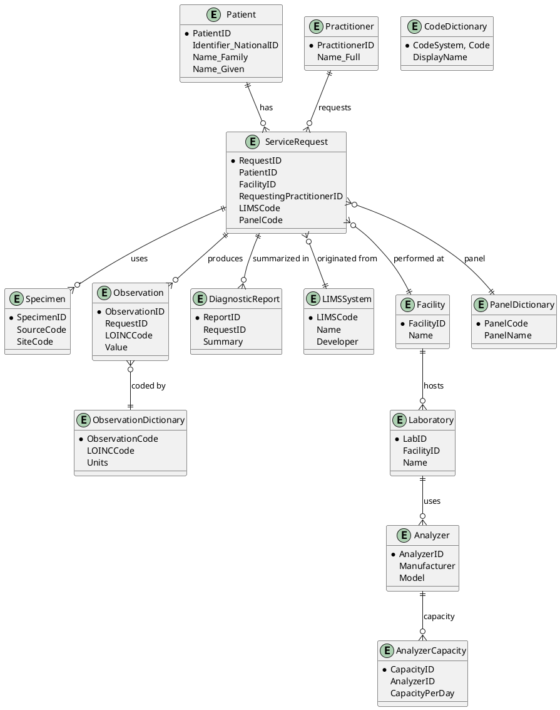

# 🧬 Modelo de Dados Universal para Sistemas de Informação Laboratorial (MUDL ou ULDM)

## 🎯 Objetivo
Este projeto visa uniformizar o armazenamento de dados laboratoriais em sistemas de informação e gestão laboratorial (LIMS), promovendo a interoperabilidade, integração e conformidade com normas internacionais como **HL7 FHIR**, **SNOMED CT** e **LOINC**.

---

## üß± Estrutura Geral do Modelo

O modelo est√° dividido em entidades principais:

- **Patient**: Dados demogr√°ficos e administrativos do doente
- **Practitioner**: Profissionais de sa√∫de envolvidos
- **ServiceRequest**: Pedido de an√°lise laboratorial
- **Specimen**: Dados da amostra recolhida
- **Observation**: Resultados laboratoriais
- **DiagnosticReport**: Relatório consolidado das análises
- **LIMSSystem**: Metadados do sistema LIMS que originou o pedido
- **Facility**: Instalações de saúde
- **Laboratory**: Laboratórios associados
- **Analyzer**: Equipamentos de an√°lise
- **AnalyzerCapacity**: Capacidade dos equipamentos
- **CodeDictionary**: Dicionário de códigos HL7, SNOMED CT e LOINC
- **PanelDictionary**: Painéis de testes laboratoriais
- **ObservationDictionary**: Observações laboratoriais e suas interpretações

---

## 🔗 Padrões Utilizados

| Padrão       | Aplicação                                                                 |
|--------------|---------------------------------------------------------------------------|
| HL7 FHIR     | Estrutura de recursos como Patient, ServiceRequest, Observation, Specimen |
| SNOMED CT    | Codificação de diagnósticos, achados, procedimentos e locais anatómicos   |
| LOINC        | Codificação de testes laboratoriais e observações                         |

---

## üßæ Script SQL Universal (schema.sql)
```sql
-- Schema.sql
-- =========================
/* UNIVERSAL LABORATORY INFORMATION SYSTEM DATA MODEL
   Compatible with: MySQL 8, PostgreSQL, SQL Server, Oracle
   Standards: HL7 FHIR, SNOMED CT, LOINC */

CREATE TABLE Patient (
  PatientID VARCHAR(64) PRIMARY KEY,
  Identifier_NationalID VARCHAR(30),
  Identifier_HealthcareNumber VARCHAR(30),
  Name_Family VARCHAR(50),
  Name_Given VARCHAR(50),
  BirthDate DATE,
  GenderCode CHAR(1),
  EthnicityCode VARCHAR(10),
  Contact_Email VARCHAR(100),
  Contact_PhoneHome VARCHAR(20),
  Contact_PhoneMobile VARCHAR(20),
  Address_LocationCode VARCHAR(10),
  Deceased BOOLEAN,
  Newborn BOOLEAN
);

CREATE TABLE Practitioner (
  PractitionerID VARCHAR(64) PRIMARY KEY,
  Name_Full VARCHAR(100),
  Identifier_Code VARCHAR(30),
  Contact_Email VARCHAR(100),
  Contact_Phone VARCHAR(20)
);

CREATE TABLE ServiceRequest (
  RequestID VARCHAR(64) PRIMARY KEY,
  PatientID VARCHAR(64) NOT NULL,
  RequestingPractitionerID VARCHAR(64),
  RequestingFacilityID VARCHAR(30),
  LIMSCode VARCHAR(10),
  PanelCode VARCHAR(20),
  PanelDescription VARCHAR(100),
  PriorityCode CHAR(1),
  RequestedDateTime DATETIME,
  SpecimenID VARCHAR(64),
  ClinicalInfo TEXT,
  ICD10Code VARCHAR(10),
  Therapy TEXT,
  FOREIGN KEY (PatientID) REFERENCES Patient(PatientID),
  FOREIGN KEY (RequestingPractitionerID) REFERENCES Practitioner(PractitionerID)
);

CREATE TABLE Specimen (
  SpecimenID VARCHAR(64) PRIMARY KEY,
  SourceCode VARCHAR(10),
  SiteCode VARCHAR(10),
  CollectionDateTime DATETIME,
  Volume FLOAT,
  RejectionCode VARCHAR(10),
  RejectionReason TEXT
);

CREATE TABLE Observation (
  ObservationID VARCHAR(64) PRIMARY KEY,
  RequestID VARCHAR(64) NOT NULL,
  LOINCCode VARCHAR(30),
  Value FLOAT,
  Units VARCHAR(20),
  ReferenceRangeLow FLOAT,
  ReferenceRangeHigh FLOAT,
  AbnormalFlagCode VARCHAR(5),
  ResultStatusCode CHAR(1),
  ResultDateTime DATETIME,
  InterpretationCode VARCHAR(20),
  Note TEXT,
  FOREIGN KEY (RequestID) REFERENCES ServiceRequest(RequestID)
);

CREATE TABLE DiagnosticReport (
  ReportID VARCHAR(64) PRIMARY KEY,
  RequestID VARCHAR(64) NOT NULL,
  ReportDateTime DATETIME,
  AuthorisedByPractitionerID VARCHAR(64),
  Summary TEXT,
  FOREIGN KEY (RequestID) REFERENCES ServiceRequest(RequestID)
);

CREATE TABLE LIMSSystem (
  LIMSCode VARCHAR(10) PRIMARY KEY,
  Name VARCHAR(100),
  Developer VARCHAR(100),
  Version VARCHAR(20),
  ReleaseYear INT,
  LicenseType VARCHAR(50),
  LicenseValidUntil DATE,
  CertificationStatus VARCHAR(50),
  HL7FHIRCompatible BOOLEAN,
  SNOMEDCompatible BOOLEAN,
  LOINCCompatible BOOLEAN
);

CREATE TABLE Facility (
  FacilityID VARCHAR(30) PRIMARY KEY,
  Name VARCHAR(100),
  TypeCode VARCHAR(10),
  CountryCode VARCHAR(2),
  Location_Point VARCHAR(100),
  NationalCode VARCHAR(30)
);

CREATE TABLE Laboratory (
  LabID VARCHAR(30) PRIMARY KEY,
  FacilityID VARCHAR(30),
  Name VARCHAR(100),
  Type VARCHAR(30),
  StaffingLevel VARCHAR(30),
  FOREIGN KEY (FacilityID) REFERENCES Facility(FacilityID)
);

CREATE TABLE Analyzer (
  AnalyzerID VARCHAR(30) PRIMARY KEY,
  Manufacturer VARCHAR(50),
  Model VARCHAR(50),
  SerialNumber VARCHAR(50),
  InstalledDate DATETIME,
  LaboratoryID VARCHAR(30),
  FOREIGN KEY (LaboratoryID) REFERENCES Laboratory(LabID)
);

CREATE TABLE AnalyzerCapacity (
  CapacityID INT PRIMARY KEY,
  AnalyzerID VARCHAR(30),
  CapacityPerDay INT,
  FOREIGN KEY (AnalyzerID) REFERENCES Analyzer(AnalyzerID)
);

CREATE TABLE CodeDictionary (
  CodeSystem VARCHAR(20),
  Code VARCHAR(30),
  DisplayName VARCHAR(100),
  Description TEXT,
  IsActive BOOLEAN,
  LastUpdated DATE,
  PRIMARY KEY (CodeSystem, Code)
);

CREATE TABLE PanelDictionary (
  PanelCode VARCHAR(20) PRIMARY KEY,
  PanelName VARCHAR(100),
  Description TEXT,
  LOINCCode VARCHAR(20),
  SNOMEDCode VARCHAR(20),
  HL7SectionCode VARCHAR(10)
);

CREATE TABLE ObservationDictionary (
  ObservationCode VARCHAR(30) PRIMARY KEY,
  Description TEXT,
  LOINCCode VARCHAR(20),
  SNOMEDCode VARCHAR(20),
  HL7ResultTypeCode VARCHAR(5),
  Units VARCHAR(20),
  ReferenceRangeLow FLOAT,
  ReferenceRangeHigh FLOAT,
  InterpretationGuideline TEXT
);
```

## 🚀 Guia de Instalação Rápida

Este guia mostra como importar o ficheiro `schema.sql` em diferentes sistemas de bases de dados relacionais.

### 🐬 MySQL 8

1. Crie uma base de dados:
   ```bash
   mysql -u root -p -e "CREATE DATABASE labdb CHARACTER SET utf8mb4 COLLATE utf8mb4_unicode_ci;"
   ```

2. Importe o ficheiro `schema.sql`:
   ```bash
   mysql -u root -p labdb < schema.sql
   ```

### üêò PostgreSQL

1. Crie uma base de dados:
   ```bash
   psql -U postgres -c "CREATE DATABASE labdb;"
   ```

2. Importe o ficheiro `schema.sql`:
   ```bash
   psql -U postgres -d labdb < schema.sql
   ```

### üêâ SQL Server

1. Crie uma base de dados:
   ```bash
   sqlcmd -S localhost -U sa -P <password> -Q "CREATE DATABASE labdb;"
   ```

2. Importe o ficheiro `schema.sql`:
   ```bash
   sqlcmd -S localhost -U sa -P <password> -d labdb -i schema.sql
   ```

### üêç Oracle

1. Crie uma base de dados:
   ```bash
   sqlplus / as sysdba "CREATE DATABASE labdb;"
   ```

2. Importe o ficheiro `schema.sql`:
   ```bash
   sqlplus labdb/ < schema.sql
   ```

## üìú Exemplo Pr√°tico: Pedido Laboratorial Simulado

### 1. Paciente
```sql
INSERT INTO Patient VALUES (
  'PAT001', 'MZ123456789', 'HC987654321', 'Mabunda', 'Celina',
  '1990-06-15', 'F', 'AFR', 'celina.mabunda@example.com',
  '214567890', '848765432', 'LOC001', 0, 0
);
```

### 2. Profissional
```sql
INSERT INTO Practitioner VALUES (
  'PRAC001', 'Dr. Armando Chissano', 'DR001', 'armando.chissano@hospital.mz', '218765432'
);
```

### 3. Pedido de Exame
```sql
INSERT INTO ServiceRequest VALUES (
  'REQ001', 'PAT001', 'PRAC001', 'FAC001', 'LIMS001',
  'PANEL001', 'Painel Bioquímico Básico', 'R', '2025-10-03 10:00:00',
  'SPEC001', 'Doente com sintomas de fadiga e icterícia', 'R17', 'Hidratado com soro'
);
```

### 4. Amostra
```sql
INSERT INTO Specimen VALUES (
  'SPEC001', 'BLD', 'VEN', '2025-10-03 09:45:00', 5.0, NULL, NULL
);
```

### 5. Observações
```sql
INSERT INTO Observation VALUES (
  'OBS001', 'REQ001', '2345-7', 1.2, 'mg/dL', 0.3, 1.0, 'H', 'F',
  '2025-10-03 11:00:00', 'SN123456', 'Valor elevado de bilirrubina total'
);

INSERT INTO Observation VALUES (
  'OBS002', 'REQ001', '2093-3', 180.0, 'mg/dL', 125.0, 200.0, 'N', 'F',
  '2025-10-03 11:00:00', 'SN654321', 'Colesterol total dentro da faixa normal'
);
```

### 6. Relatório Diagnóstico
```sql
INSERT INTO DiagnosticReport VALUES (
  'REP001', 'REQ001', '2025-10-03 12:00:00', 'PRAC001',
  'Doente apresenta hiperbilirrubinemia ligeira. Colesterol normal. Recomenda-se avaliação hepática adicional.'
);
```

### 7. Metadados do Sistema LIMS
```sql
INSERT INTO LIMSSystem VALUES (
  'LIMS001', 'LabMoz', 'MozTech Solutions', 'v3.2.1', 2023,
  'Propriet√°ria', '2026-12-31', 'Certificado HL7 FHIR', 1, 1, 1
);
```

### 8. Dicionários de Códigos
```sql
INSERT INTO CodeDictionary VALUES (
  'LOINC', '2345-7', 'Bilirrubina Total', 'Mede a concentração total de bilirrubina no sangue', 1, '2025-01-01'
);

INSERT INTO CodeDictionary VALUES (
  'LOINC', '2093-3', 'Colesterol Total', 'Mede o colesterol total no sangue', 1, '2025-01-01'
);

INSERT INTO CodeDictionary VALUES (
  'SNOMED CT', 'SN123456', 'Hiperbilirrubinemia', 'Achado clínico de bilirrubina elevada', 1, '2025-01-01'
);

INSERT INTO CodeDictionary VALUES (
  'SNOMED CT', 'SN654321', 'Colesterol normal', 'Achado clínico de colesterol dentro da faixa', 1, '2025-01-01'
);
```
## 🛠️ Requisitos Técnicos
- Compatível com MySQL 8, PostgreSQL, SQL Server e Oracle
- Suporte a tipos geográficos para localização (POINT, GEOGRAPHY, SDO_GEOMETRY)
- Preparado para integração com APIs HL7 FHIR RESTful

## üìä Diagrama ER (PlantUML)
Salva como er-diagram.puml e renderiza em [PlantText](https://www.planttext.com/):

```plantuml
@startuml
entity Patient {
  * PatientID
  Identifier_NationalID
  Name_Family
  Name_Given
}

entity Practitioner {
  * PractitionerID
  Name_Full
}

entity ServiceRequest {
  * RequestID
  PatientID
  FacilityID
  RequestingPractitionerID
  LIMSCode
  PanelCode
}

entity Specimen {
  * SpecimenID
  SourceCode
  SiteCode
}

entity Observation {
  * ObservationID
  RequestID
  LOINCCode
  Value
}

entity DiagnosticReport {
  * ReportID
  RequestID
  Summary
}

entity LIMSSystem {
  * LIMSCode
  Name
  Developer
}

entity Facility {
  * FacilityID
  Name
}

entity Laboratory {
  * LabID
  FacilityID
  Name
}

entity Analyzer {
  * AnalyzerID
  Manufacturer
  Model
}

entity AnalyzerCapacity {
  * CapacityID
  AnalyzerID
  CapacityPerDay
}

entity CodeDictionary {
  * CodeSystem, Code
  DisplayName
}

entity PanelDictionary {
  * PanelCode
  PanelName
}

entity ObservationDictionary {
  * ObservationCode
  LOINCCode
  Units
}

Patient ||--o{ ServiceRequest : "has"
Practitioner ||--o{ ServiceRequest : "requests"
ServiceRequest ||--o{ Specimen : "uses"
ServiceRequest ||--o{ Observation : "produces"
ServiceRequest ||--o{ DiagnosticReport : "summarized in"
ServiceRequest }o--|| LIMSSystem : "originated from"
Facility ||--o{ Laboratory : "hosts"
Laboratory ||--o{ Analyzer : "uses"
Analyzer ||--o{ AnalyzerCapacity : "capacity"
Observation }o--|| ObservationDictionary : "coded by"
ServiceRequest }o--|| PanelDictionary : "panel"
ServiceRequest }o--|| Facility : "performed at"
@enduml
```

## 🔑 Estratégia para uma Base Completa
### 1. LOINC
- Fonte oficial: [LOINC.org](https://loinc.org/downloads/)
- Disponível em CSV/SQL, com todos os códigos laboratoriais, clínicos e de observação.
- Inclui: código, nome, descrição, unidades, método, sistema, escala, tipo de observação.
- Pode ser importado diretamente para a tabela `ObservationDictionary`.
### 2. SNOMED CT
- Fonte oficial: [SNOMED International](https://www.snomed.org/get-snomed)
- Requer licença (gratuita para países membros, Para paises ainda não membros, pode ser usada via SNOMED Global Patient Set).
- O **GPS (Global Patient Set)** contém ~7.000 conceitos clínicos essenciais, incluindo diagnósticos e achados laboratoriais.
- Pode ser carregado no `CodeDictionary`.
### 3. HL7
- Fonte oficial: [HL7 Terminology](https://terminology.hl7.org/)
- Inclui tabelas de códigos como:
- Result Status (F, C, P, etc.)
- Abnormal Flags (N, H, L, A, etc.)
- Priority Codes (S, R, U, etc.)
- Estes s√£o conjuntos pequenos e podem ser populados integralmente.
### 4. Painéis de Testes (PanelDictionary)
- Podem ser usados para mapear painéis nacionais (ex.: bioquímica, hematologia, virologia, microbiologia) para LOINC.
- Exemplo:
    - Painel Bioquímico Básico → LOINC Panel 24323-8
    - Hemograma Completo ‚Üí LOINC Panel 58410-2
    - Painel HIV ‚Üí LOINC Panel 56888-1

## 📂 Como Popular os Dicionários
### a) Importar LOINC
- Baixar o ficheiro `LOINC.csv` do site oficial.
- Criar um script de importação para `ObservationDictionary`.
- Exemplo de mapeamento:
```sql
INSERT INTO ObservationDictionary
(ObservationCode, Description, LOINCCode, SNOMEDCode, HL7ResultTypeCode, Units, ReferenceRangeLow, ReferenceRangeHigh, InterpretationGuideline)
VALUES
('OBS_GLU', 'Glucose [Massa/volume] no sangue', '2345-7', NULL, 'NM', 'mg/dL', 70, 110, 'Valores elevados indicam hiperglicemia');
```
### b) Importar SNOMED CT (GPS)
- Baixar o **Global Patient Set** em CSV.
- Carregar no `CodeDictionary` com `CodeSystem = 'SNOMED CT'`.
### c) Importar HL7
- Popular manualmente (s√£o tabelas pequenas).
- Exemplo:
```sql
INSERT INTO CodeDictionary VALUES ('HL7', 'F', 'Final Result', 'Resultado final', 1, '2025-01-01');
INSERT INTO CodeDictionary VALUES ('HL7', 'C', 'Corrected Result', 'Resultado corrigido', 1, '2025-01-01');
```

## üöÄ Caminho Pr√°tico
1. Criar um `seed_data.sql` que:
    - Importa todos os códigos HL7.
    - Importa os painéis principais (bioquímica, hematologia, virologia, microbiologia).
    - Importa alguns exemplos de LOINC e SNOMED CT.
2. Adicionar scripts ETL para carregar:
    - O LOINC completo (98k códigos).
    - O SNOMED GPS (~7k conceitos).

## 📌 Licença
Este projeto est√° licenciado sob a MIT License.
## 🤝 Contribuições
Contribuições são bem-vindas!
Sugestões incluem:
- Melhorias no modelo
- Adição de novos códigos ao dicionário
- Criação de perfis FHIR personalizados
- Tradução da documentação para outros idiomas

## üìû Contacto
- Autor: Irzelindo Salvador
- Localização: Maputo, Moçambique
- Email: [irzelindo.salvador@gmail.com]


